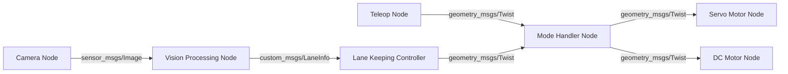

# ADR-006: Lane Detection Implementation Strategy for ROS2 Nodes

## Context
For this module, our system requires reliable lane detection capabilities for assisted driving features. The implementation needs to process camera feed data and provide accurate lane information to the control system. There are multiple approaches to implementing lane detection, each with different trade-offs.

The key considerations are:
- **Reliability**: Consistent lane detection under varying conditions
- **Maintainability**: Ability to improve and modify the implementation
- **Development Effort**: Time and expertise required for implementations
- **Flexibility**: Ability to adapt to different road conditions
- **Processing Power**: Limited computational resources of our system?

## Decisions
We could be implementing a modular architecture that allows different lane detection strategies while maintaining consistent interfaces. The two main implementation approaches are:

1. **Classical Computer Vision Approach**:
   - Pipeline of image processing techniques:
     - Perspective transform for bird's-eye view
     - Color thresholding for lane marking detection
     - Edge detection (Canny)
     - Line detection (Hough transform)
     - Curve fitting for lane boundaries
   - Advantages:
     - More transparent and debuggable
     - Lower computational requirements
     - Easier to tune for specific conditions
     - No training data required
	 - Could use case for us to learn!!
   - Disadvantages:
     - May struggle with complex scenarios
     - Requires careful parameter tuning
     - Less adaptable to varying conditions

2. **Machine Learning Approach**:
   - Deep learning model for lane detection:
     - Convolutional Neural Network (CNN) architecture
     - End-to-end lane detection and segmentation
     - Pre-trained models with fine-tuning
   - Advantages:
     - Better handling of complex scenarios
     - More adaptable to varying conditions
     - Potentially more robust
   - Disadvantages:
     - Higher computational requirements
     - Requires training data
     - Less transparent decision making
     - More complex deployment process

## Implementation Strategy
1. **Node Architecture**:
   - Vision Processing Node:
     - Input: sensor_msgs/Image
     - Output: custom_msgs/LaneInfo
     - Interchangeable implementation (CV or ML)
   - Lane Keeping Controller Node:
     - Input: custom_msgs/LaneInfo
     - Output: geometry_msgs/Twist
     - Implementation agnostic to lane detection method
   - Mode Handler Node:
     - Input: custom_msgs/LaneInfo
     - Output: geometry_msgs/Twist
     - Enables runtime selection of lane keeping algo.

2. **Development Phases**:
   - Phase 1: Implement classical CV approach
     - Establish baseline performance
     - Gather real-world data
   - Phase 2: Develop ML approach in parallel
     - Use gathered data for training
     - Compare performance with CV approach
   - Phase 3: Enable runtime switching between approaches
     - Dynamic selection based on conditions
     - A/B testing capabilities

## Consequences
### Positive
- Modular design allows testing different implementations
- Clear separation of concerns between detection and control
- Flexibility to upgrade or change implementations
- Ability to distribute processing across machines
- Great opportunity to LEARN

### Negative
- Need to maintain multiple implementations
- Additional complexity in system architecture
- Need for comprehensive testing of both approaches
